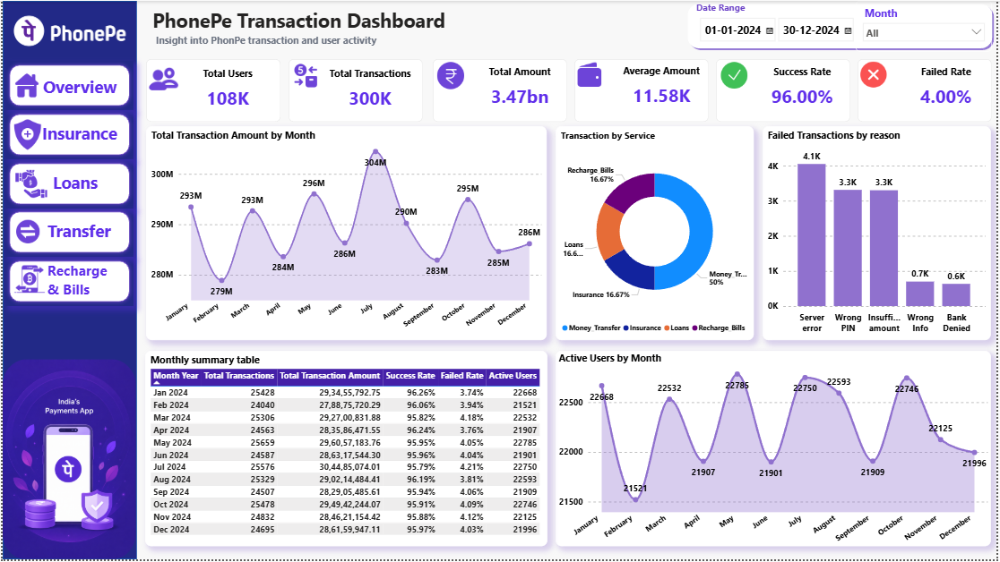
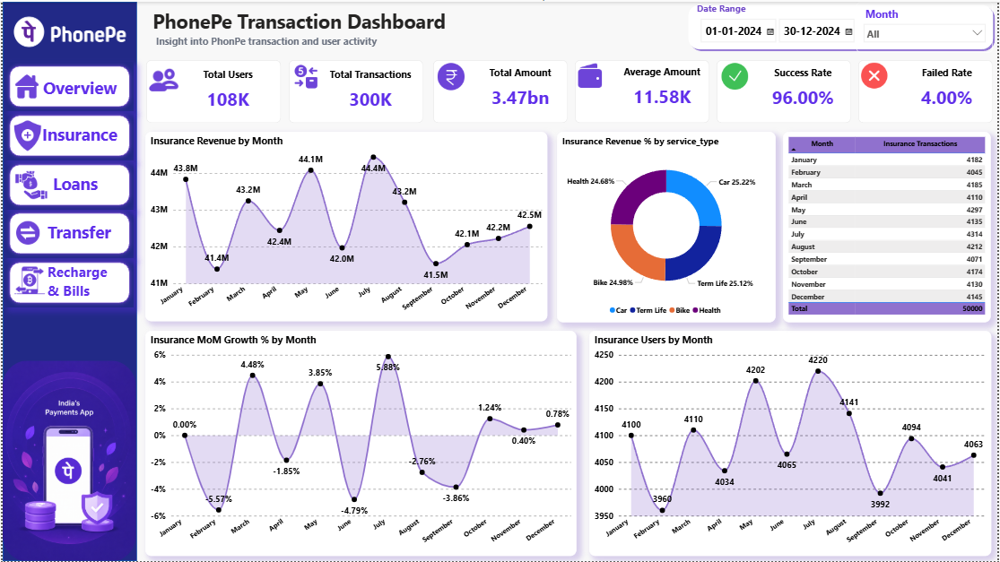
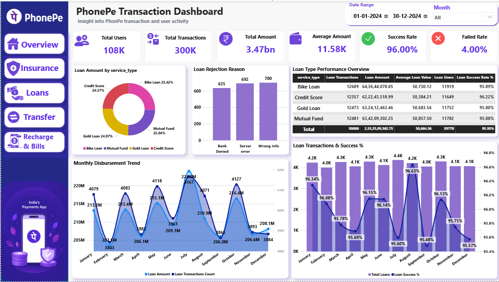
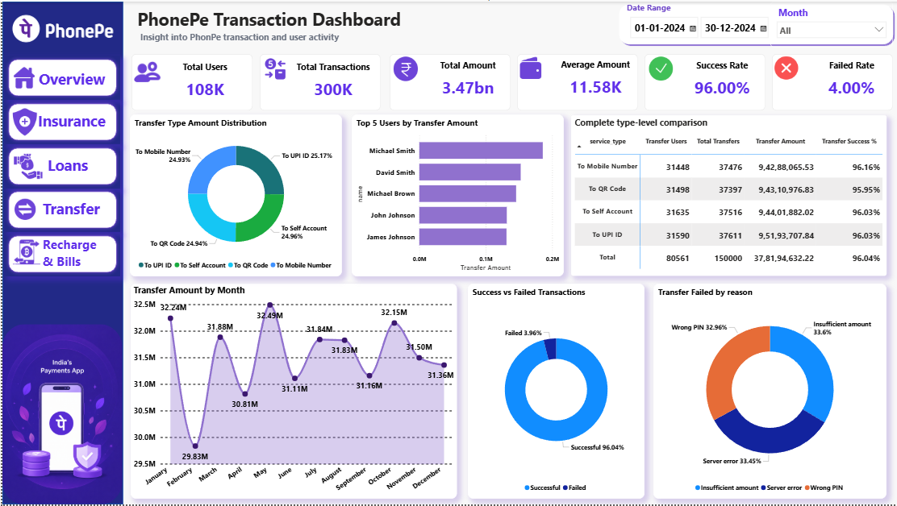
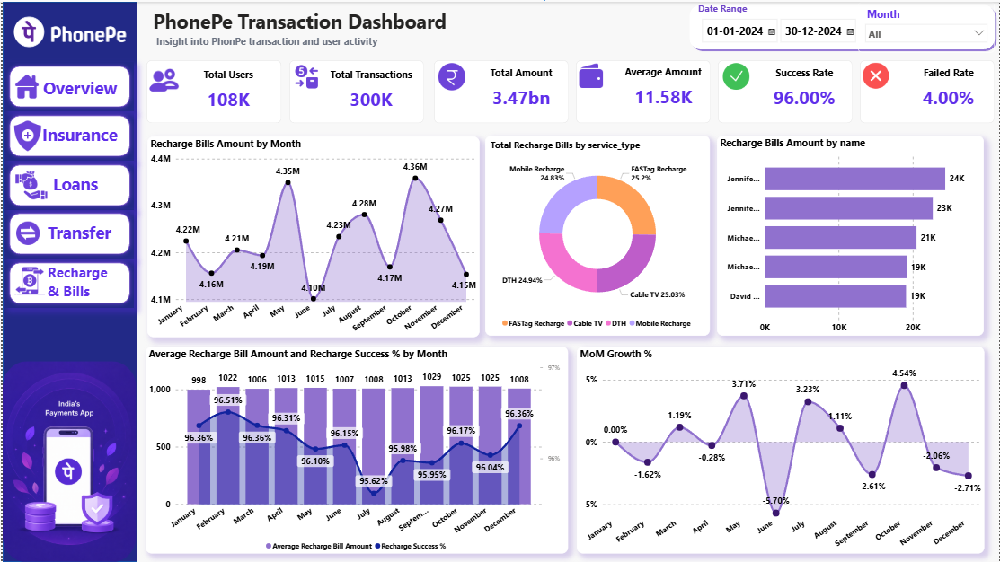

# 📱 PhonePe Transaction Analysis Dashboard

## 📊 Project Overview

This project analyzes PhonePe transaction data to understand transaction trends, payment performance, service categories, transfer behavior, and failed transaction patterns.

The dashboard was developed using **Power BI** with **Power Query, DAX, and data visualization techniques** to convert raw transaction data into meaningful business insights.

---

## 🎯 Business Objective

The main objective of this project is to:

* Analyze overall transaction performance
* Identify transaction trends over time
* Compare different service categories
* Analyze successful and failed transactions
* Understand money transfer behavior
* Identify major transfer failure reasons
* Analyze Recharge & Bills transactions
* Provide actionable business insights through an interactive dashboard

---

## 🛠️ Tools & Technologies

* **Power BI** – Dashboard development & visualization
* **DAX** – Measures and KPIs
* **Power Query** – Data cleaning and transformation
* **Excel** – Data preparation
* **SQL** – Data analysis and querying

---

## 📌 Dashboard Features

### 1. Overview Dashboard

The overview page provides a high-level summary of PhonePe transactions.

Key KPIs include:

* Total Transactions
* Total Transaction Amount
* Successful Transactions
* Failed Transactions
* Success Rate
* Average Transaction Amount
* Transaction Growth %

Visualizations include:

* Transaction Trend
* Transaction Status
* Service Category Analysis
* Transfer Type Analysis
* Transaction Amount Analysis

---

### 2. Insurance Analysis

This section focuses on insurance-related transactions.

Analysis includes:

* Insurance Transaction Volume
* Insurance Transaction Amount
* Average Insurance Transaction Value
* Insurance Transaction Trends
* Insurance Performance by Period

---

### 3. Loan Analysis

This section analyzes loan-related transactions.

Key analysis:

* Total Loan Transactions
* Total Loan Amount
* Average Loan Transaction Amount
* Loan Transaction Trends
* Loan Performance by Period

---

### 4. Money Transfer Analysis

This section provides detailed insights into money transfer transactions.

Analysis includes:

* Transfer Type Transaction Share
* Average Transfer Amount by Type
* Successful vs Failed Transfers
* Transfer Failure Reasons
* Transfer Transaction Trends

---

### 5. Recharge & Bills Analysis

This section analyzes Recharge & Bills transactions.

Analysis includes:

* Recharge & Bills Transaction Volume
* Transaction Amount
* Service Type Performance
* Recharge Transaction Trends
* Bill Payment Analysis
* Successful vs Failed Transactions
* Average Transaction Amount

---

## 📈 Key KPIs

| KPI                        | Description                           |
| -------------------------- | ------------------------------------- |
| Total Transactions         | Total number of transactions          |
| Total Transaction Amount   | Total value of transactions           |
| Successful Transactions    | Number of successful transactions     |
| Failed Transactions        | Number of failed transactions         |
| Success Rate               | Percentage of successful transactions |
| Average Transaction Amount | Average value per transaction         |
| Transaction Growth %       | Period-over-period transaction growth |

---

## 🧮 Example DAX Measures

### Total Transactions

```DAX
Total Transactions =
COUNTROWS(transactions)
```

### Total Transaction Amount

```DAX
Total Transaction Amount =
SUM(transactions[transaction_amount])
```

### Successful Transactions

```DAX
Successful Transactions =
CALCULATE(
    [Total Transactions],
    transactions[payment_status] = "Successful"
)
```

### Failed Transactions

```DAX
Failed Transactions =
CALCULATE(
    [Total Transactions],
    transactions[payment_status] <> "Successful"
)
```

### Success Rate

```DAX
Success Rate =
DIVIDE(
    [Successful Transactions],
    [Total Transactions],
    0
)
```

---

## 🎛️ Interactive Features

The dashboard includes interactive features such as:

* Date range filtering
* Service category filtering
* Transaction status filtering
* Dynamic KPIs
* Interactive charts
* Drill-down analysis
* Bookmark-based navigation
* Overview → Category-specific dashboard navigation

---

## 📸 Dashboard Preview

### Overview


### Insurance


### Loans


### Money Transfer


### Recharge & Bills


---

## 🔍 Key Insights

The analysis helps identify:

* Overall transaction performance and trends
* Changes in transaction volume over time
* Performance of different service categories
* Successful and failed transaction patterns
* Major reasons behind failed transfers
* Differences in transaction values across transfer types
* Performance of Recharge & Bills services

> **Note:** Specific numerical insights should be updated based on the final dashboard results.

---

## 💡 Business Recommendations

Based on the analysis, businesses can:

1. Monitor failed transactions and identify the most common failure reasons.
2. Improve services with consistently high transaction failures.
3. Analyze high-performing transaction categories and focus on their growth.
4. Monitor transaction trends to identify peak periods.
5. Optimize customer experience for frequently used services.
6. Track average transaction value across different transaction types.

---

## 📂 Project Structure

```text
PhonePe-Transaction-Analysis/
│
├── README.md
│
├── Dataset/
│   └── transactions.xlsx
│
├── SQL/
│   └── phonepe_analysis.sql
│
├── PowerBI/
│   └── PhonePe_Transaction_Analysis.pbix
│
└── images/
    ├── overview.png
    ├── insurance.png
    ├── money-transfer.png
    └── recharge-bills.png
```

---

## 🚀 Project Outcome

This project demonstrates practical skills in:

* Data Cleaning
* Data Transformation
* Data Modeling
* DAX
* KPI Development
* Business Intelligence
* Data Visualization
* Interactive Dashboard Design
* Business Analysis

---

## 👨‍💻 Author

**Kumar Abhijeet Anand**

Aspiring Data Analyst | Power BI | SQL | Excel | DAX

---

⭐ If you find this project useful, consider giving the repository a star!
